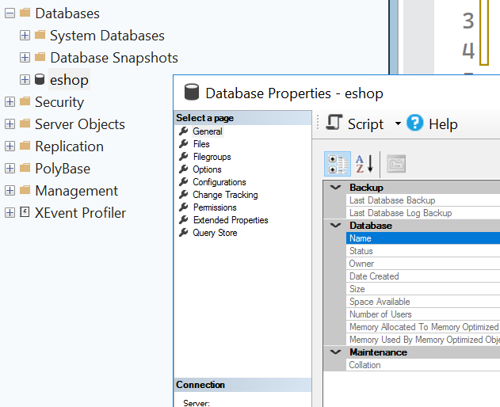
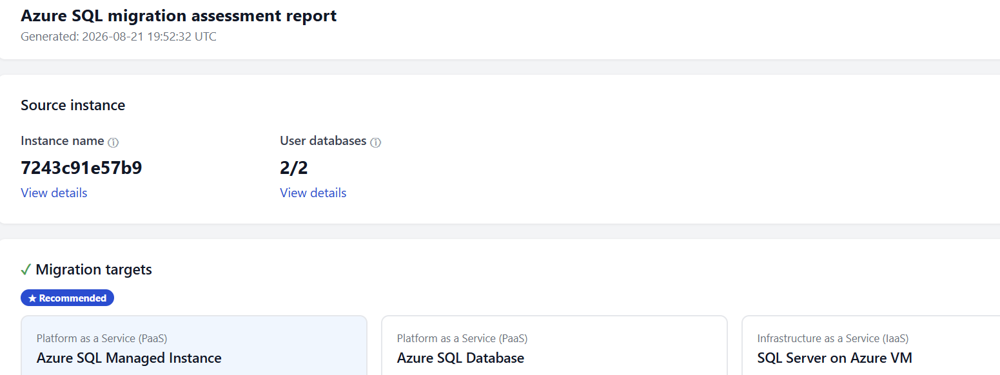
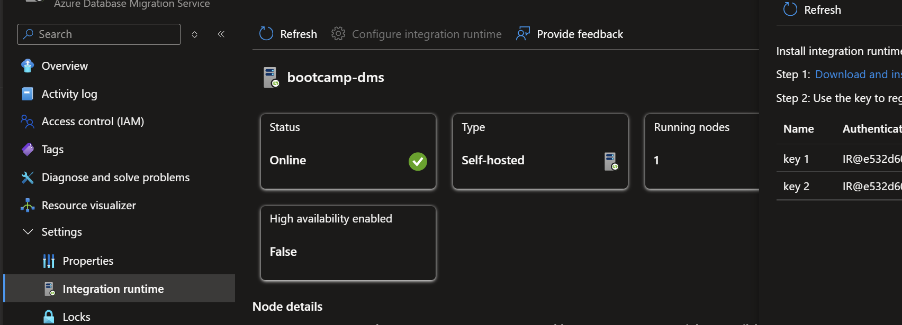

# Lab 05: Database Modernization Bootcamp

## SQL Server to Azure SQL Database — Student Migration Challenges

**Scenario:** Migrate the eShop database from SQL Server on VM to Azure SQL Database by using Azure Database Migration Service (DMS).

Lab 04 now provisions exactly one target. The standard path selects
`LAB04_DATABASE_MODE=azureSql`; complete the Azure SQL Database challenges
below. If an instructor selected `sqlMi`, use the SQL Managed Instance challenge
as the target-specific path and do not expect an Azure SQL logical server or
private endpoint to exist.

Now that the application is upgraded and moved to Azure PaaS services, it is time to modernize and migrate the database. 

***Security rule:*** *Never expose passwords, storage keys, SAS tokens, or connection strings in screenshots or submissions. Do not enable public RDP or public Azure SQL access unless the instructor explicitly requires it.*

Learning objectives

Students will learn to:

* Gather information about a SQL server database
* Prepare and assess a SQL Server database for migration to Azure.
* Learn about diffenent authentication mechanisms in SQL server
* Learn about different types of backups and migration techniques
* Run an assessment of the source SQL Server database, analyze the report
* Use the managed database target selected during Lab 04.
* Configure private connectivity to the Azure SQL Database from both the Azure VM and also target PaaS services
* Create Azure Data Migration Service (DMS) and configure to run the "Self hosted Integration Runtime" on the Azure VM.
* Run DMS offline migration to Azure SQLDB
* Run and monitor an offline migration. Verify migrated data by query only.
* When `sqlMi` was selected in Lab 04, run DMS online migration to SQL MI and verify migration.
* Configure the application with the database FQDN exported by Lab 04.
* Document differences between Azre SQLDB and Azire SQL MI and lessons learned. 

## Challenge 1 — Validate the source database

### Student tasks

1. Connect to the provided VM using the instructor-approved method.
2. Confirm that SQL Server services are running - service named "SQL Server (MSSQLSERVER)"
3. Determine the database credential the retail app is using. You can use Github coplilot chat to find out from the application source codebase.
4. Connect to the local SQL Server with SQL Server Management Studio (SSMS) using "sa" SQL login given to you
5. Record the SQL Server version,edition - right click on the server and type "new query". Execute the following SQL

```sql
Use master;
select @@version ;
```
7. Right click on database eshop and click on peroperties to determine database size, collation, disk file name and size of database files and "recovery mode", like [](./images/Challenge_1_db_properties.png)
8. While there, also note down all the "page" names displayed when checking on database "properties" section.
9. <u>Note do this only if this database VM is on Azure or some other cloud -->  </u>Map the VM data drives to azure disks. You can do find the SQL data and log file information from the "Files" page. Besides size what else is different between the two disks and why so ?
10. Verify that the VM has no unintended public exposure.
11. What are the different ways tuauthenticate to this eshop SQL database ?
12. (Research on this) What is a logical and physical backup of SQL server ? How is recovery mode and logical backup related ?
13. Put the database into full recovery mode in SSMS running this query

```sql
alter database eshop set recovery full ;
```

11. Run this query using SSMS. Investigate the results.

```text
DBCC CHECKDB (N'eShop') ;
```

## Success criteria

* SSMS connects to the source instance.
* The student records the source version, edition etc.
* You can explain at least 4 different authentication mechanisms and show at least 2 ways to connnect
* You can explain recovery model and different backups.


## Challenge 2 — Pre-migration assessment of the source database 

## Student tasks

1. Using SSMS, right click on the server and choose "Migrate SQL Server"
2. <u>Do not Migrate or Upgrade the database</u>. Run a "Migration rediness assessment".
3. Investigate the report. Find out compatibility issues with different SQL targets [](./images/Challenge_2_assessment_report.png)


## Success criteria

* You learn different options of running SQL on Azure
* Understand the assessment report and the comptatibility issues.

## Challenge 3 — Create a database migration service for migration

## Student tasks

1. In the same region where you will deploy Azure SQL as a migration target, deploy Azure Data Migration Services (DMS)
2. After the DMS is installed, deploy and configure a self-hosted Integration Runtime on the source database server. Go to Settings --> Integration runtime on the portal and follow the instructions. See here [](./images/Challenge_3_DMS_SHIR_instructions.png)
3. Verify that the "SHIR" shows as online on DMS in Azure portal. 
4. <u>Note:</u> only the public IP of the SHIR nodes show up on DMS

## Success criteria

- DMS is employed with SHIR shown as online

### Extra Challenge 

- Can you have multuple SHIR using the same DMS service ?

## Challenge 4 — Online Migraton to SQL Managed Instance

Complete this challenge only when Lab 04 was provisioned with
`LAB04_DATABASE_MODE=sqlMi`. The managed instance and empty `eShop` database
already exist; do not deploy an additional managed instance.

## Student tasks

1. Create a SQL Managed instance - in an empty sublet of a Vnet. It should have authentication using entra and SQL enabled, note down the SQL admin credentials.

2. Connect to the SQL MI using SSMS using entra. Note: if using MCAPS subscription it will only allow an authentication using entra-login only. 

<u>Note: </u> Your SQL MI may have a scheduled "start/stop" time. Make sure to have it started everyday before your work begins.

3. DMS needs a backup of the source database to migrate - to Azure blob or file share. To backup to blob, follow these steps

   - Verify if the database is in full recovery mode as you changed in challenge #1.

   ```sql
   SELECT
      name, recovery_model_desc 
   FROM sys.databases ;
   ```

   - Create a storage account in the same region where you have DMS and MI. Create a container in it.

   - Ensure that the on-prem source server can connect to the storage account

   - Create a SAS token for the storage account

   - On the source SQL database, create a credential and verify it.

   ```sql
   CREATE credential [https://<stroage-account>.blob.core.windows.net/<container>>] WITH IDENTITY='SHARED ACCESS SIGNATURE', SECRET = '<sas_token>' ;

   SELECT * from sys.credentials ;
   ```

   - Execute a full backup to this storage account in SSMS

   ```sql
   backup database eshop to URL = 'https://<stroage-account>.blob.core.windows.net/<container>/<backup-file-name' ;
   ```

4. <b> [Optional] </b> If your source VM is in Azure, it helps to have the "SqlIaasExtension" extension installed

```shell
az vm extension list -g <vm-resource-group> --vm-name <vm-name> -o table
```

5. SQL MI should be able to read the backup to restore the backup of the source database from the storage account. To enable that, assign "storage blob data reader" role to the managed identity of your SQL MI

   5a. First Find out the system assigned managed identity of the SQL Managed instance

   Enter the name of the resource group that contains the SQL managed instance:

```powershell
$resourceGroup = Read-Host "Enter the SQL managed instance resource group"
```

Get the SQL managed instance and its identity from that resource group. This guide expects the resource group to contain exactly one SQL managed instance in a resource group:

```powershell
$managedInstanceDetails = @(
    az sql mi list `
        -g $resourceGroup `
        --query "[].{SQLMI:name, IdentityType:identity.type, ManagedIdentity:identity.principalId}" `
        --output json |
        ConvertFrom-Json
)

if ($managedInstanceDetails.Count -ne 1)
{
    throw "Expected exactly one SQL managed instance in resource group '$resourceGroup', but found $($managedInstanceDetails.Count)."
}

$managedInstanceDetails | Format-Table -AutoSize
$managedInstance = $managedInstanceDetails[0].SQLMI
```

Next find out the managed identity for the MI instance

```powershell
$miPrincipalId = az sql mi show `
    -g $resourceGroup `
    -n $managedInstance `
    --query identity.principalId `
    --output tsv
```

Finally, assign this managed identity "storage blob data reader" role for the storage account where you have your database backup kept.

```powershell
az role assignment create `
    --assignee-object-id $miPrincipalId `
    --assignee-principal-type ServicePrincipal `
    --role "Storage Blob Data Reader" `
    --scope $(az storage account show `
        --name <backup-storage-account> `
        --resource-group <backup-storage-account-rg> `
        --query id --output tsv)
```

6. Now you are ready to start the migration. On azure portal for DMS, Click on new migration. Choose blob as the backup storage location and online as the migration mode. 

7a. When it asks if "your SQL server instance is tracked in azure" - you can say yes <b>only if</b> the source VM is in azure with SQL extension installed, or is outside Azure and is SQL Arc enabled. If you click yes it should automatically find your SQL server based on your resoure group and location.

7b. If you say no, then choose what is your source VM and specify a logical SQL server ( not your MI) where DMS can create a small SQL database to track migration progress for restartability.

8. Next, choose your SQL MI as the target. 

9. Now DMS will need to see the location of the backup you took earlier. Remember that DMS, the target SQL MI and the storage account - all need to be in the same Azure region. Also note that the database backup can be at the root folder or one folder under root in the container - not below that. The target database should not exist already - DMS restore creates the database from its physical backup

10. Once the migration is complete, the migration goes to "ready to cutover" stage. Complete the migration

11. Connnect to the eshop database on SQL MI. 

12. Change the application connectivity to switch to SQL MI.
#### Congratulations - you have migrated to Azure SQL

## Challenge 5  — Enable private endpoint for SQL Managed Instance

## Student tasks

1. Create a private endpoint for the Azure SQL logical server. Go to Azure portal - -> Security --> Networking --> Private Access
2. Configure the private endpoint in the same region where you want to connect from.
3. One the azure portal, search for your private DNS zone just created for SQL Database. Under DNS Management ---> Virtual Network Links, 
add links to the Vnet where you want to connect to this SQL database from azure. 
4. Ensure net connectibity using private endpoint from your source something like 
```text
test-NetConnection <your-logical-server>.database.windows.net -Port 1434
```

privatelink.database.windows.net <b>"privatelink.database.windows.net"</b> 

1. Link the private DNS zone to the VNet.
2. Associate the private endpoint with a DNS zone group.
3. Confirm that the private endpoint connection is approved.

## Success criteria

* The Azure SQL server name resolves to a private IP from the VM.
* TCP 1433 is reachable from the VM.
* Public network access remains disabled.

## Challenge 6  — Application readiness - Entra-id authentication for app

## Student tasks

1. Identify the Lab 04 retail Container App and its system-assigned managed identity:

   ```powershell
   $containerApp = az containerapp list `
     --resource-group '<application-resource-group>' `
     --query '[0].{name:name, principalId:identity.principalId}' `
     --output json | ConvertFrom-Json
   ```

2. Connect to the Azure SQL `eShop` database as the configured Microsoft Entra administrator.
3. Create a container user for the Container App identity. Use a unique alias and its object ID so the database principal does not depend on Entra display-name uniqueness:

   ```sql
   CREATE USER [caldova_retail_app] FROM EXTERNAL PROVIDER
     WITH OBJECT_ID = '<container-app-principal-id>';

   ALTER ROLE db_datareader ADD MEMBER [caldova_retail_app];
   ALTER ROLE db_datawriter ADD MEMBER [caldova_retail_app];
   ```

4. Do not grant `db_owner` or `db_ddladmin`; the runtime application reads and writes data but does not own schema deployment.
5. Prepare a passwordless application connection string using the Azure SQL FQDN:

   ```text
   Server=tcp:<server>.database.windows.net,1433;Initial Catalog=eShop;Authentication=Active Directory Managed Identity;Encrypt=True;TrustServerCertificate=False;Connection Timeout=30;
   ```

6. Confirm TLS encryption and managed-identity authentication.
7. Test representative application operations.
8. Identify features that require redesign after migration.
9. Document rollback criteria and a cutover plan.

## Success criteria

The Container App identity has only the required database roles, the connection string contains no password, and the student demonstrates that application readiness requires more than successful data copy.


Suggested class schedule

|  |  |  |
| --- | --- | --- |
| **Phase** | **Challenges** | **Suggested time** |
| Source preparation | 1–3 | 45–60 minutes |
| Target preparation | 4–7 | 60 minutes |
| DMS configuration | 8–9 | 45 minutes |
| Troubleshooting | 10–11 | 60 minutes |
| Data migration | 12 | 30–60 minutes |
| Validation and closeout | 13–15 | 60 minutes |


### Instructor debrief questions

1. Why must compatibility assessment occur before migration?
2. What roles do Private Link and private DNS play?
3. Why should clients use the Azure SQL FQDN instead of its private IP?
4. What is the role of SHIR in an offline DMS migration?
5. How did you isolate error 2060 from network connectivity?
6. Why is independently deploying schema a valid migration strategy?
7. What evidence is required before declaring the migration successful?
8. What would change for a production migration with minimal downtime?
9. Which steps should be automated for repeatable delivery?

**Lab principle:** A migration is complete only after compatibility, connectivity, schema, data, application behavior, security, and operational readiness have all been validated with evidence.

---

[← Previous: Deploy the Azure Foundation](../../day-1/04-deploy-to-azure/README.md) | [Next: Deploy Code with GitHub Actions →](../06-deploy-code-with-github-actions/README.md)